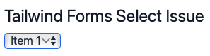
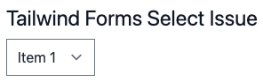

# tailwind-forms-safari-select-issue

Minimal reproduction for @tailwindcss/forms issue with rendering `<select>` elements in MacOS Safari. 

`npm start` build then open http://localhost:8000/

The select drop down is not rendered correctly in MacOS Safari.

It is rendered correctly in every other browser include iOS/iPadOS Safari.

